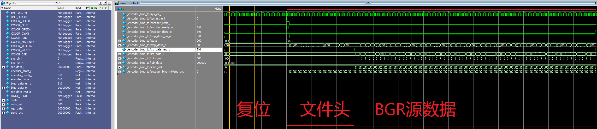

# Encoder_BMP

**描述**：该工程在Verilog上实现了BMP编码，仿真测试通过。

## 工程接口

输入：（TB文件内置测试彩条图片，长宽自定）RGB888

输出：BMP码流，通过TB写入文件

## 复现过程

+ 在modelsim中新建工程，导入encoder和tb文件
+ 直接运行，编码完一帧会自动停止，并在目录下生成一个bmp文件

## 版本更新

### 已知问题

1、在长宽极其低的情况下，tb喂给编码器的RGB数据有误？正常8X8等以上测试倒是没问题

 ### 进度更新

**202340125：**

完成初版设计
