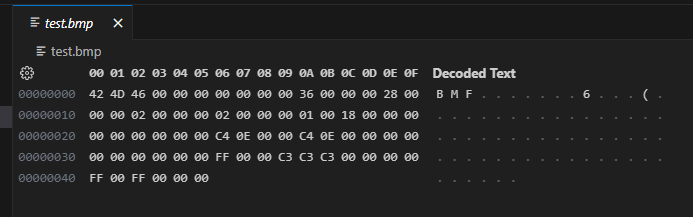

# BMP文件格式详解

**简介：**本文档适用于未接触bmp文件格式的人提前了解需要编解码的图片格式，对于学习和理解HDL代码结构也有一定帮助。当然，网上以及本解析仅限于个人片面理解，仅供参考。

## 一、BMP文件格式

**1.1文件内容**

使用vscode的hex编辑器打开测试的4x4的test.bmp，可以发现文件数据的单位是一个字节8位，由16进制表示。文件内容分为数据头和源数据两个部分，其中数据头54个字节（bmp文件头 14字节+位图信息40字节+3N字节调色板，这个可以不要），剩下是不定长度的源数据

**1.2文件格式**

**1.2.1数据头格式**

| 字节编号 | 字节值(十六进制)  | 数值注释                                                     |
| -------- | ----------------- | ------------------------------------------------------------ |
| 0~1      | 42 4D（固定       | 表示文件类型，固定为ASIIC码“BM”                              |
| 2~5      | XX XX XX XX       | 表示文件大小，倒着排序，例如上图是00 00 00 46，即共70个字节  |
| 6~9      | 00 00 00 00（固定 | 保留位                                                       |
| 10~13    | 36 00 00 00 (默认 | 数据偏移位置，指从第几个字节后开始是源数据，也可以反向理解为数据包长度，也是倒着读 00 00 00 36，即头有54个字节 |
| 14~17    | XX XX XX XX       | 位图信息头大小，40个字节，也就是28，倒着写就是28 00 00 00    |
| 18~21    | XX XX XX XX       | 图像的宽度，有多少个像素                                     |
| 22~25    | XX XX XX XX       | 图像的高度，有多少个像素，通常来说是正数，如果是负数的补码，就说明图像需要上下倒过来显示，但这并不是所有BMP解码器都支持 |
| 26~29    | 01 00（默认       | 指颜色平面数，可以理解为图层，一般就一个                     |
| 28~29    | 18 00 (默认       | 每个像素多少位，一般就是RGB888，24位                         |
| 30~33    | 00 00 00 00(默认  | 说明图像压缩类型，一般为0，表示不压缩                        |
| 34~37    | 00 00 00 00       | 图像压缩大小，一般为0                                        |
| 38~41    | XX XX XX XX       | 图像水平分辨率，像素/米，随便来                              |
| 42~45    | XX XX XX XX       | 图像垂直分辨率，像素/米，随便来                              |
| 46~49    | 00 00 00 00（默认 | 颜色索引数，一般为0 ，表示都使用                             |
| 50~53    | 00 00 00 00       | 表示有重要颜色数量，一般为0，表示都重要                      |

**1.2.2源数据格式**

编码方式：1、从下到上，从左至右。2、当一行的像素字节不满8的整数倍时，自动补0。

例如对于截图所示的2X2图片来说，一个RGB888的像素只有3个字节，先传左下FF 00 00的蓝色，再传C3 C3 C3的灰色，然后补充两个字节0，再切到上一行执行相同的操作。（注：BMP中采用BGR排序

## 二、BMP文件编码过程

1、输入编码参数和编码请求，生成数据包

2、拉高数据输出Valid，输出数据包

3、拉高数据输入Ready，开始传输数据，并按照整行补充部分字节

4、完成传输，输出Done信号

## 三、常见问题

+ **1、如何编码正常朝向图片或者解码正常朝向图片？**
  + 对于编码来说，有两种思路，如果显示端的bmp解码支持负地址，则可以将数据头中的高度改为负数的补码即可；如果不支持，那就要考虑做帧缓存了，然后从最后一行开始读取——这听起来就很麻烦对吧，所以对于FPGA来说，反了就反了吧。
  + 对于解码来说，肯定有帧缓存了，那就倒着写入，顺序读取就好了

## 更新日志

20240123：初始版本

20240126：修订 字节编码序号错误、文件大小72 字节 —>70字节 错误
